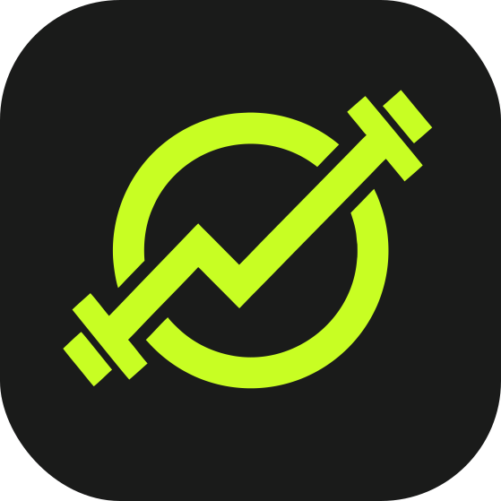
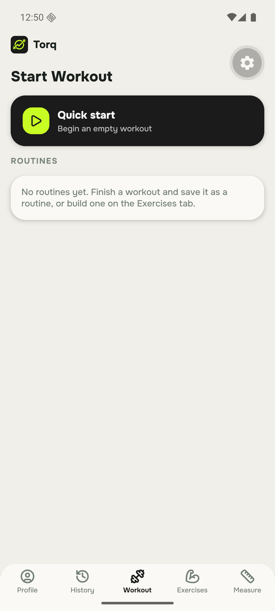
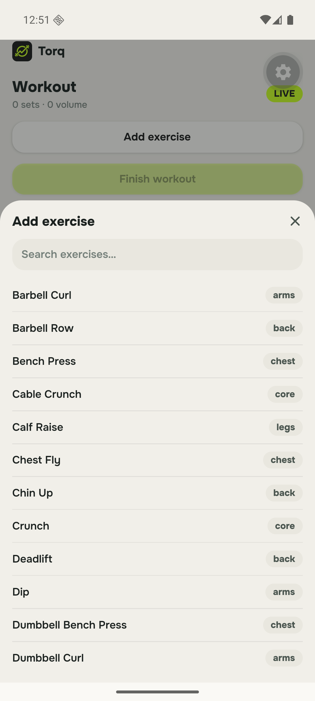
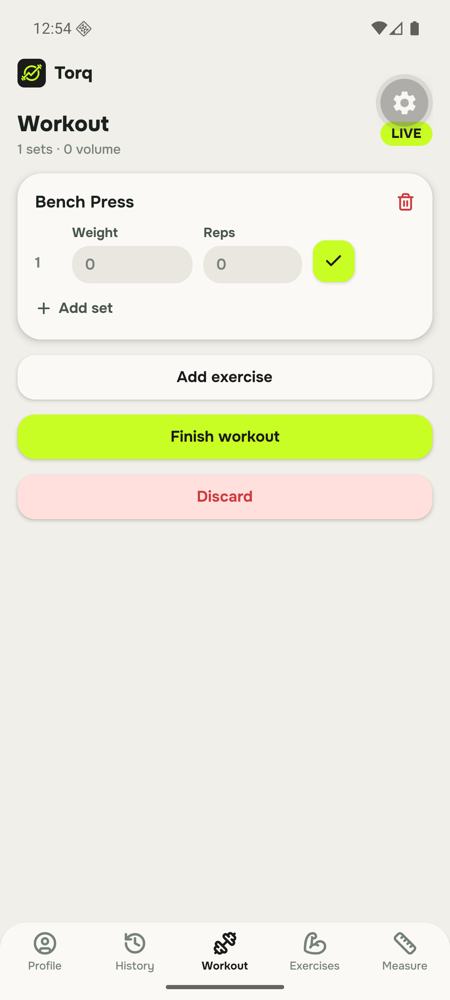

  
  <h1>Torq</h1>
  
<strong>A personal workout-session tracker.</strong> 
  Log sets, chase progress, own your data.

---

Torq is my personal take on a [Strong](https://www.strong.app/)-style gym
logger: an Android-first React Native app for tracking workout sessions,
built around a live set-logger — start a session, add exercises, punch in
weight × reps, tick sets as you go, finish, done.

  
  &nbsp;
  
  &nbsp;
  

## What it does

- **Live workout logging** — quick-start an empty session or launch a saved
  routine; the Workout tab becomes the set logger while a session is active.
- **Exercise library** — a searchable 1,500-exercise catalog
  ([ExerciseDB](https://oss.exercisedb.dev)) with animated demos, muscle
  breakdowns and step-by-step instructions, importable into your own
  library alongside custom exercises.
- **Routines** — reusable workout templates.
- **History** — every finished session with date, duration, set count and
  total volume.
- **Body measurements** — weight, body fat and girths over time.
- **Offline-first, sync optional** — everything lives on the device; sign in
  and the dataset delta-syncs across devices via Supabase (last-write-wins,
  row-level security, server-stamped versions).

## How it's built

| | |
|---|---|
| Runtime | Expo SDK 57 · React Native 0.86 · React 19 · TypeScript (strict) |
| Styling | Warm clay/bento design system · NativeWind v5 · Tailwind CSS v4 |
| Type & icons | Onest · lucide |
| Storage | Single JSON snapshot in AsyncStorage (local-first) |
| Cloud | Supabase auth + generic JSONB mirror tables with RLS |

The visual language — clay shadows, bento cards, pill chips — is shared with
[grit](https://github.com/adilzhanY/grit), my task tracker, re-accented in Torq's
brand lime `#C8FE23` on ink `#1A1B1A`.

---

Personal project by Adilzhan — not published to any app store.

