

  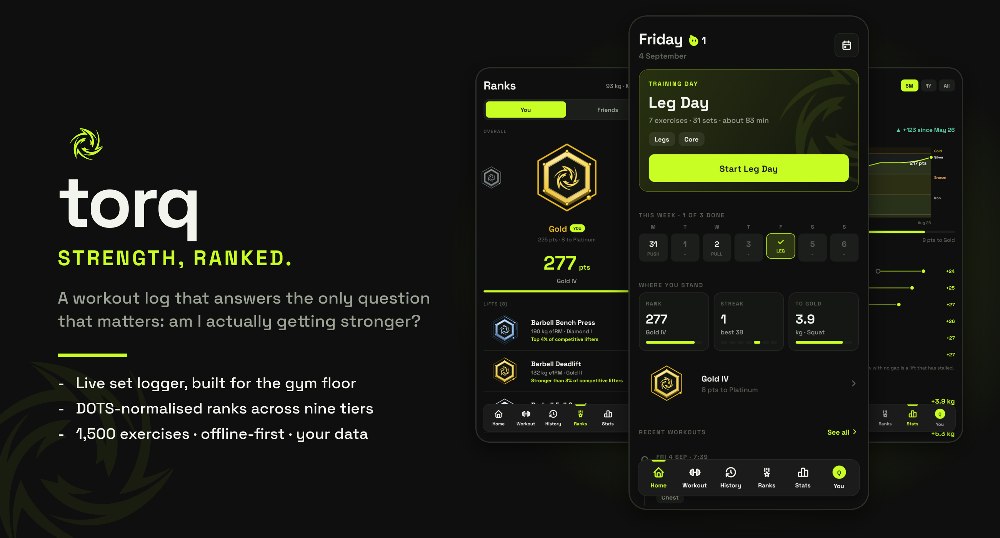

   
  
  
  
  

 

  <h3>Most gym apps tell you how much you lifted. Almost none tell you how strong that makes you.</h3>
  
<b>torq does.</b> Every set you log is scored against the DOTS formula — the same
  normalisation powerlifting uses to compare a 60&nbsp;kg lifter with a 95&nbsp;kg one —
  and turned into a rank you climb across nine tiers.

 

---

## Open it and it already knows what today is

<table>
<tr>
<td width="42%">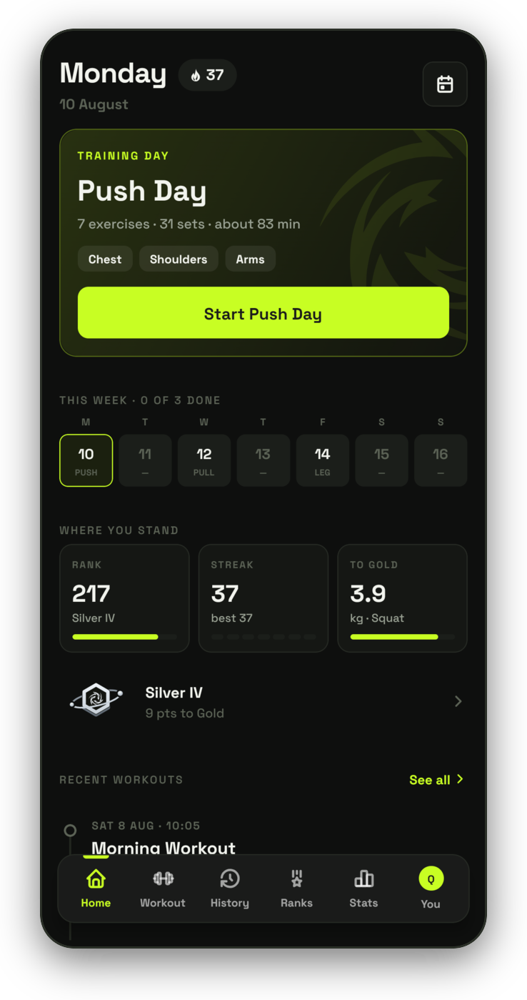</td>
<td valign="top">

### The day, not a dashboard

Home is one question: **what am I doing today?**

A training day is a lime panel with the session name, the muscles it hits, how
long it will take and one button. A rest day is a different object entirely —
grey, moonlit, no primary action, and it spends its space telling you *what is
recovering* and *what lands next*.

Under it: the week as seven tagged days, your rank and streak and the exact
kilos standing between you and the next tier.

**No volume anywhere.** Nobody trains to move tonnes.

</td>
</tr>
</table>

<table>
<tr>
<td valign="top">

### A logger built for the gym floor

Weight × reps, tick, next. Your last session sits beside every row so you know
what to beat, and the app suggests the next load with double progression — up
when you hit your targets, repeat when you miss, deload when you stall twice.

- **Rest timer** that drains across the row and counts you in out loud
- **Warm-up ramps** that remember the percentages *per exercise*
- **Swipe left** to delete a set, sticky notes that come back every session
- Set types (warm-up, drop set, failure) and per-set rest overrides

</td>
<td width="42%">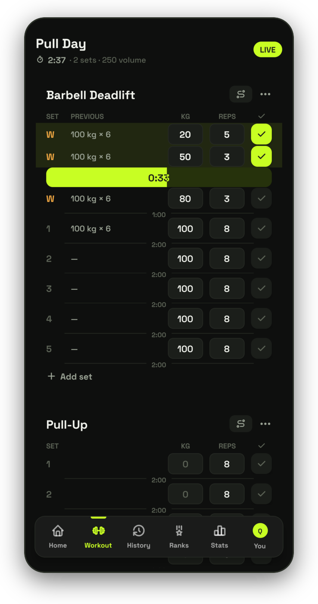</td>
</tr>
</table>

<table>
<tr>
<td width="42%">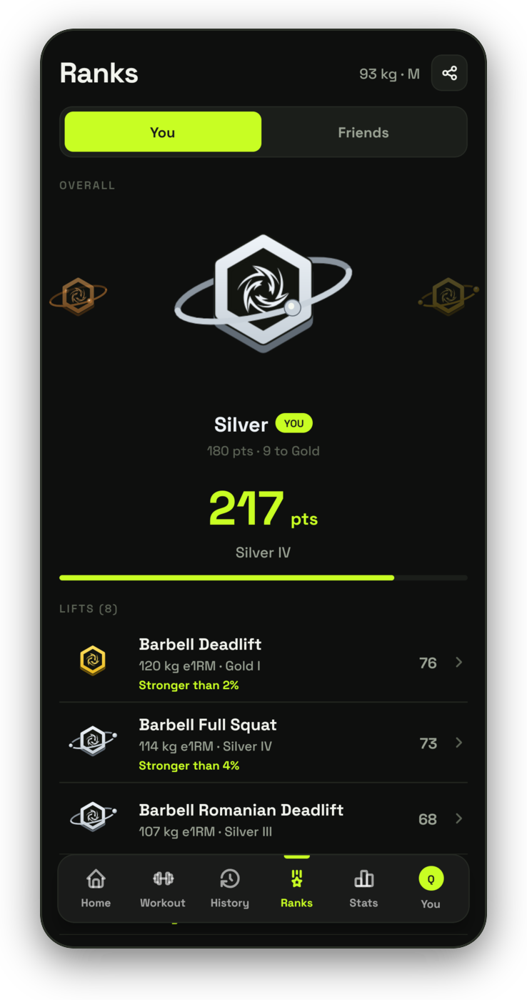</td>
<td valign="top">

### Nine tiers. One number that means something.

Rust → Iron → Bronze → Silver → Gold → Platinum → Diamond → Elite → World Class.

Your rank comes from your best estimated 1RM on each lift, scored with **DOTS**,
so it is normalised for bodyweight and sex — the same 100&nbsp;kg bench is a
different achievement at 60&nbsp;kg than at 110&nbsp;kg, and the number knows it.

Every competition lift also carries a **percentile**, measured against
2.2&nbsp;million lifters in the OpenPowerlifting database. And it never says
"top 10% of people" — that population is everyone who entered a sanctioned
meet, a far stronger crowd than the gym floor, so the app says
*"of competitive lifters"* every single time it shows the number.

</td>
</tr>
</table>

<table>
<tr>
<td valign="top">

### Progress that shows the climb

Points over time with the tier bands drawn behind them, so you can see the
Gold line you are pushing toward — and a before/after bar per lift showing
exactly what moved and what stalled.

Hollow dot = then. Filled = now. A row with no gap is a lift that has gone
nowhere, and the chart refuses to hide it.

</td>
<td width="42%">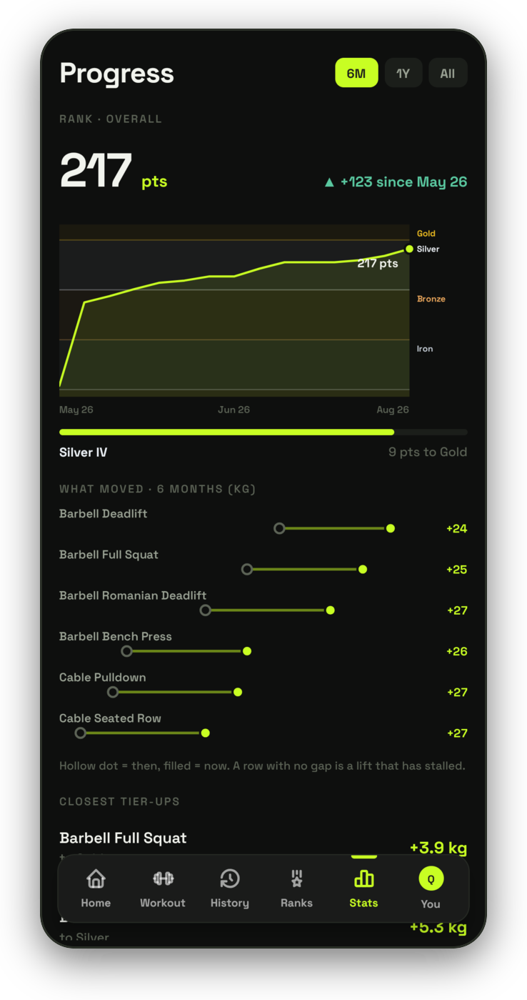</td>
</tr>
</table>

<table>
<tr>
<td width="42%">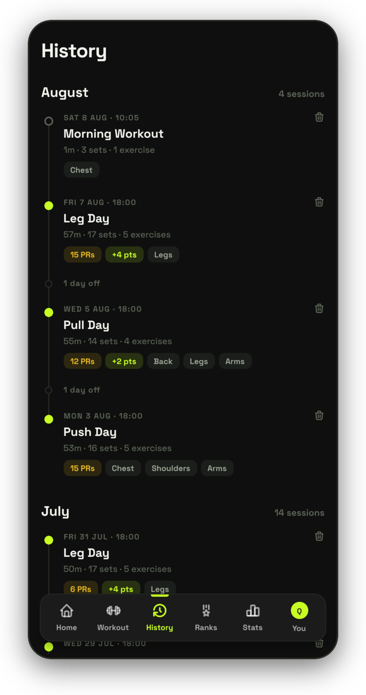</td>
<td valign="top">

### A log that shows your pattern

Not a wall of identical cards. A rail down the left with a node per session,
**lime when that session set a record**, and the row says what the session
*did*: records, rank points gained, muscles worked.

The empty days are named between them — *"2 days off"* — because your pattern
across a year says more than any single session's numbers.

</td>
</tr>
</table>

---

## More of it

<table>
<tr>
<td width="25%" align="center">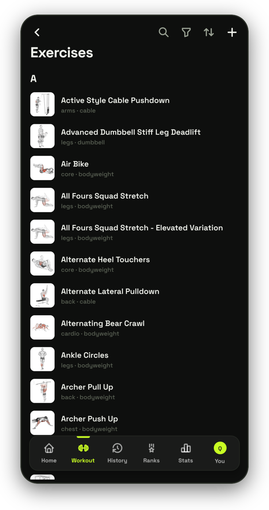 <b>1,500 exercises</b> Animated demos, muscle maps and instructions, searchable by any word</td>
<td width="25%" align="center">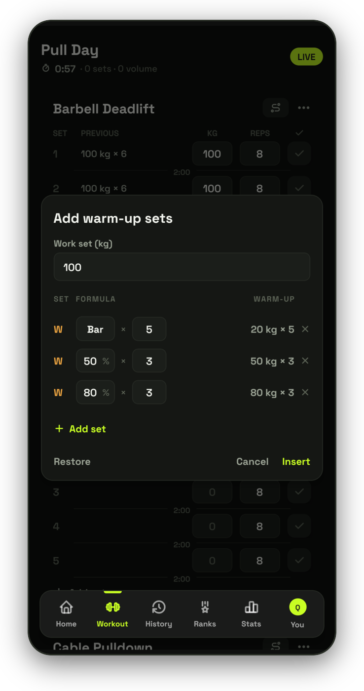 <b>Warm-up ramps</b> Bar × 5, 50% × 3, 80% × 3 — editable, and remembered per exercise</td>
<td width="25%" align="center">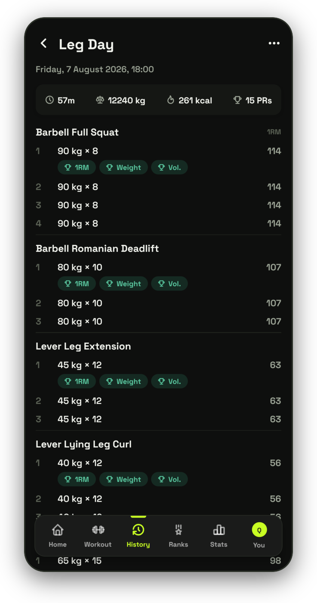 <b>Records, called out</b> 1RM, weight and volume PRs flagged on the set that set them</td>
<td width="25%" align="center">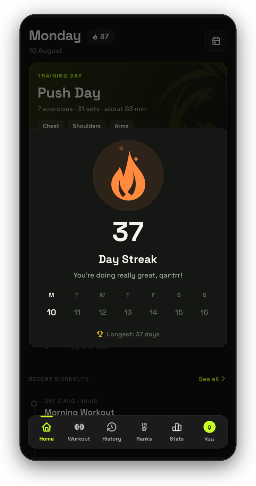 <b>Plan-aware streaks</b> Rest days don't break it. Three missed sessions in a row do.</td>
</tr>
</table>

<table>
<tr>
<td width="50%" align="center">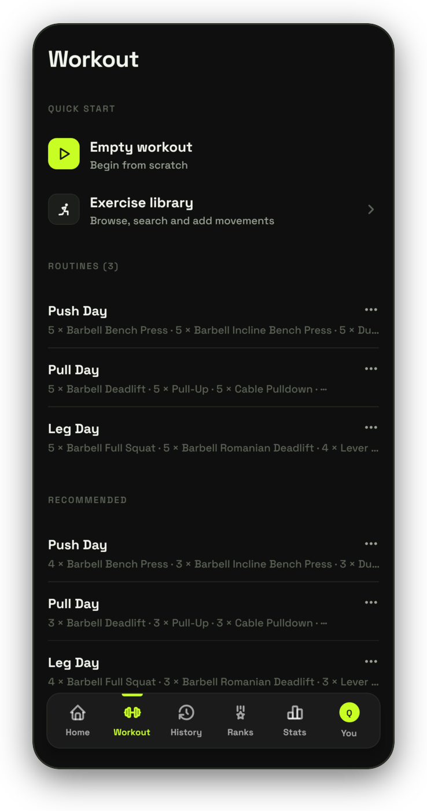 <b>Routines &amp; a real plan</b> Pick your goal, your days and your focus, and torq builds the training week around them</td>
<td width="50%" align="center">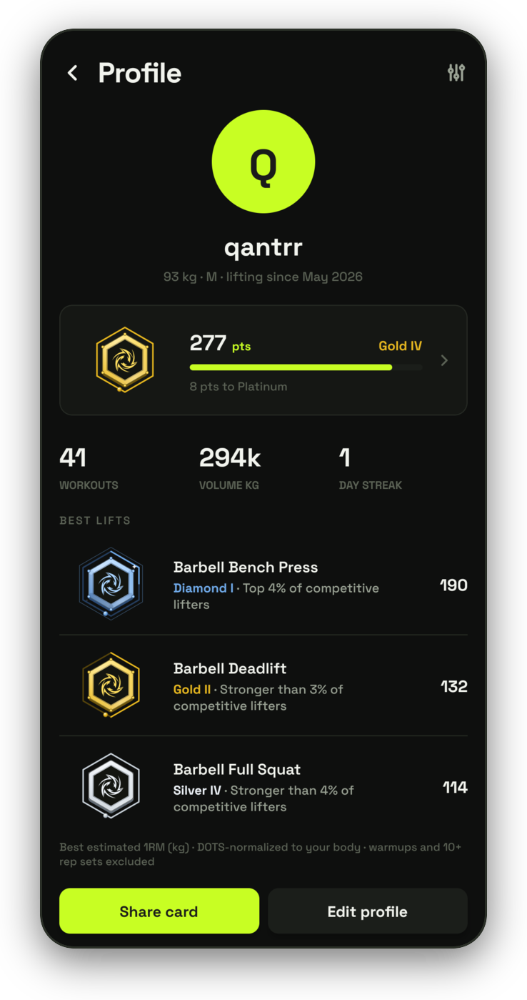 <b>Your athlete card</b> Rank, best lifts, percentiles — shareable as a story image</td>
</tr>
</table>

And when you want someone to race: add friends by handle, compare head-to-head
**on points rather than kilos** (comparing raw weight between a 60&nbsp;kg and a
95&nbsp;kg lifter would undo the whole point), and opt into a global board per
lift. Being findable and being ranked globally are two separate switches, and
both are off until you turn them on.

---

## Built like it matters

| | |
|---|---|
| **Runtime** | Expo SDK 57 · React Native 0.86 · React 19 · TypeScript (strict) |
| **Design** | Cardless near-black system · lime `#C8FE23` · Space Grotesk · Tabler icons |
| **Storage** | Local-first — one JSON snapshot in AsyncStorage, works with no account |
| **Cloud** | Supabase auth + last-write-wins delta sync behind row-level security |
| **Ranking** | Official DOTS polynomial · percentiles from 2.2M OpenPowerlifting lifters |
| **Tests** | 198 vitest assertions over the pure logic the product's claims live in |

A few decisions worth naming:

- **Cloud sync is free forever.** Holding someone's training history hostage
  behind a subscription is not a business model.
- **Nothing leaves the device by default.** Publishing a rank, appearing in
  search, entering the global board — three separate opt-ins.
- **Implausible lifts are gated** from anything other people can see, because
  a decimal-point typo shouldn't rewrite a leaderboard.
- **The app is fully usable with no account.** Guest mode is a first-class path,
  not a trial.

---

  Built by <a href="https://github.com/adilzhanY">Adilzhan</a> · Android-first · screenshots are the real app, not mockups

